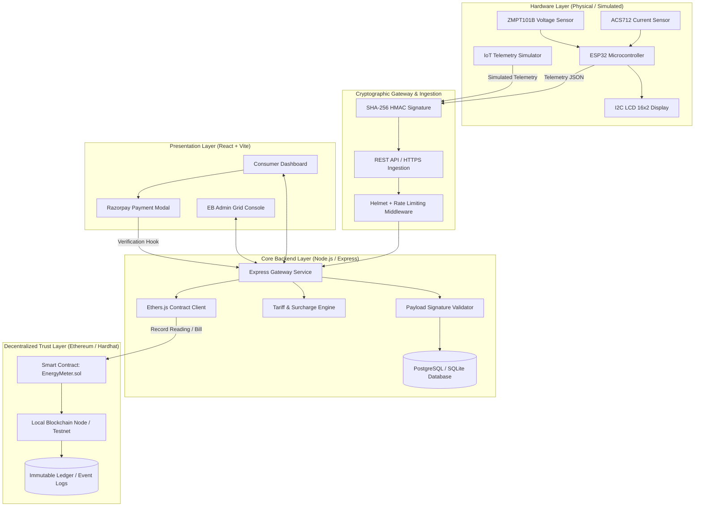

<div align="center">

# ⚡ ENARGY: Blockchain-Powered Smart Energy Metering Platform
### Tamper-Proof IoT Telemetry • Automated Smart Contract Billing • Transparent Decentralized Grid 🌐🔋

[](https://github.com/Kishkindhan-A/block-chain)
[](https://reactjs.org/)
[](https://nodejs.org/)
[](https://soliditylang.org/)
[](https://ethereum.org/)
[](https://hardhat.org/)
[](https://tailwindcss.com/)
[](LICENSE)

<p align="center">
  <b>ENARGY</b> is an enterprise-grade decentralized energy ecosystem bridging physical IoT smart meters (ESP32) and the Ethereum blockchain to deliver tamper-proof telemetry, automated tariff billing via smart contracts, and real-time consumption dashboards for electricity providers and consumers.
</p>

[Explore Repository](https://github.com/Kishkindhan-A/block-chain) • [Quick Start](#-quick-start-all-in-one-runner) • [Architecture](#%EF%B8%8F-system-architecture) • [Security & Penetration Testing](#-security--penetration-testing) • [Credentials](#-default-credentials)

</div>

---

## 📖 Executive Summary & Problem Statement

Conventional power distribution grids and electromechanical/digital smart meters face critical bottlenecks:
- **Tampering & Energy Theft**: Physical line bypassing and meter recalibration cause massive non-technical losses annually.
- **Opaque Centralized Billing**: Discrepancies between physical meter counters and utility database records lead to consumer distrust and disputes.
- **Delayed Fault Detection**: Outages, line anomalies, and phase imbalances are reported retroactively rather than detected in real time.
- **Manual Payment Friction**: Complex billing cycles result in delayed payments and revenue collection inefficiencies.

### The ENARGY Solution
ENARGY solves these challenges by anchoring IoT sensor telemetry into an immutable blockchain layer:
1. **On-Device Cryptographic Signing**: Each ESP32 smart meter computes a SHA-256 cryptographic HMAC hash of its electrical readings (voltage, current, power factor, energy) prior to transmission.
2. **Dual-Layer Validation**: The backend gateway verifies payload authenticity and submits state digests to an **Ethereum smart contract (`EnergyMeter.sol`)**.
3. **Automated Trustless Billing**: Smart contracts execute tiered tariff calculations (e.g., TNEB-compliant slabs) and trigger automated bill generation with on-chain cryptographic receipts.
4. **Integrated Payment Settlement**: Embedded Razorpay payment gateway reconciles consumer bill settlements directly into the verified billing ledger.

---

## 🏗️ System Architecture



---

## 🚀 Key Features

| Feature | Description |
|:---|:---|
| **🛡️ Tamper-Proof Cryptographic Telemetry** | Every packet broadcast from smart meters includes sensor digests that are authenticated by the backend and recorded to the blockchain. |
| **⛓️ Smart Contract Billing Engine** | `EnergyMeter.sol` guarantees that billing calculations, tariff multipliers, and payment reconciliations cannot be manipulated or disputed. |
| **📊 Real-Time Grid Analytics** | Sub-second streaming of Voltage ($V$), Current ($A$), Active Power ($W$), Power Factor ($\cos \theta$), and cumulative Energy ($kWh$). |
| **💳 Seamless Payment Integration** | Razorpay-backed online checkout with instant status confirmation and automated blockchain receipt issuance. |
| **👥 Dual Role-Based Portals** | Dedicated experiences for **Electricity Board (EB) Administrators** (grid monitoring, meter management, tamper alerts) and **Consumers** (live graphs, billing history, dispute resolution). |
| **🔌 Universal Database Adapter** | Runs out of the box with zero-setup SQLite fallback or scales to PostgreSQL for production deployments. |
| **⚙️ Single-Command Orchestrator** | Complete multi-process orchestration (`start_all.js`) launching blockchain node, contract deployer, backend API, frontend, and IoT simulator together. |

---

## 🛠️ Technology Stack

| Domain | Technologies |
|:---|:---|
| **Frontend Web App** | React 18, Vite, Tailwind CSS, Lucide Icons, Chart.js, Axios |
| **Backend & Microservices** | Node.js, Express.js, Helmet, CORS, Ethers.js (v6), Razorpay SDK |
| **Blockchain & Web3** | Solidity (^0.8.19), Hardhat, Ethereum Local Testnet, Sepolia compatibility |
| **Databases & ORM** | PostgreSQL (`pg`), SQLite3 fallback, raw SQL migrations |
| **Hardware & Firmware** | ESP32 DevKit V1, C++ (Arduino Framework), ACS712 (Current), ZMPT101B (Voltage), I2C 1602 LCD |
| **Security & Auditing** | SHA-256 HMAC signing, Helmet HTTP header hardening, npm audit security benchmarks |

---

## 📂 Repository Structure

```text
block-chain/
├── Blockchain_Based_Energy_Meter-main/
│   ├── backend/                        # Node.js & Express API Server
│   │   ├── blockchain/
│   │   │   └── client.js               # Ethers.js integration with EnergyMeter contract
│   │   ├── db/
│   │   │   ├── pool.js                 # PostgreSQL & SQLite fallback connection pool
│   │   │   └── schema.sql              # Database DDL schemas
│   │   ├── middleware/
│   │   │   ├── auth.js                 # JWT / role authentication
│   │   │   ├── validateReading.js      # Telemetry bounds validation
│   │   │   └── verifySignature.js      # Cryptographic HMAC verification
│   │   ├── routes/
│   │   │   ├── billing.js              # Bill generation & history
│   │   │   ├── energy.js               # Ingestion of sensor telemetry
│   │   │   ├── payment.js              # Razorpay checkout & webhook verification
│   │   │   └── register.js             # User & meter provisioning
│   │   ├── scripts/
│   │   │   ├── create_db.js            # Automated DB initialization
│   │   │   └── test_signed.js          # IoT smart meter signed telemetry simulator
│   │   ├── .env.example                # Configuration template
│   │   ├── package.json
│   │   └── server.js                   # Application entrypoint & security middleware
│   │
│   ├── blockchain/                     # Ethereum Smart Contract Environment
│   │   ├── contracts/
│   │   │   └── EnergyMeter.sol         # Core smart contract for meters, readings & bills
│   │   ├── scripts/
│   │   │   └── deploy.js               # Hardhat deployment script
│   │   ├── hardhat.config.js           # Network & compiler configuration
│   │   └── package.json
│   │
│   ├── esp32_firmware/                 # Embedded C++ Firmware
│   │   └── energy_meter/
│   │       └── energy_meter.ino        # ESP32 sensor acquisition & HMAC hashing code
│   │
│   ├── frontend/                       # React + Vite Dashboard
│   │   ├── src/
│   │   │   ├── pages/
│   │   │   │   ├── Admin/              # EB Admin monitoring & billing console
│   │   │   │   ├── Consumer/           # Consumer portal (live telemetry & payment)
│   │   │   │   └── Login.jsx           # Role-based authentication view
│   │   │   ├── services/
│   │   │   │   └── api.js              # Centralized Axios client
│   │   │   ├── App.jsx                 # Route definitions
│   │   │   └── main.jsx
│   │   ├── index.html
│   │   ├── vite.config.js
│   │   └── package.json
│   │
│   ├── RUN_COMMANDS.md                 # Fast command cheatsheet
│   ├── package.json                    # Workspace wrapper package
│   └── start_all.js                    # Automated multi-service orchestration launcher
│
├── package.json                        # Root helper launcher
└── README.md                           # Documentation root
```

---

## ⚡ Quick Start: All-In-One Runner

You can spin up the entire ecosystem (Blockchain node + Smart contract deployment + Backend API + React Frontend + IoT Simulator) with a **single command**.

### 1. Clone the Repository
```bash
git clone https://github.com/Kishkindhan-A/block-chain.git
cd block-chain
```

### 2. Install Root Dependencies
```bash
npm install
```

### 3. Launch All Services
```bash
npm start
```

#### What `npm start` executes automatically:
1. 🟢 **Blockchain Node**: Boots a local Ethereum Hardhat node on `http://127.0.0.1:8548`.
2. 🟢 **Contract Deployment**: Compiles and deploys `EnergyMeter.sol`, capturing the newly generated contract address.
3. 🟢 **Environment Injection**: Automatically syncs `CONTRACT_ADDRESS` and `BLOCKCHAIN_RPC_URL` into `backend/.env`.
4. 🟢 **Backend API Server**: Starts Express server with Helmet security on `http://localhost:3000` (or `3002`).
5. 🟢 **Frontend Dashboard**: Compiles and serves the Vite React application on **`http://localhost:5173`**.
6. 🟢 **IoT Telemetry Simulator**: Streams signed, live cryptographic sensor packets for meters `MTR001`, `MTR002`, and `MTR003`.

---

## 🛠️ Manual Step-by-Step Setup

If you prefer to run each service individually in separate terminal windows:

### Terminal 1: Blockchain Node & Smart Contracts
```bash
cd Blockchain_Based_Energy_Meter-main/blockchain
npm install
npx hardhat node --port 8548

# In another terminal tab, deploy contract to local node:
npx hardhat run scripts/deploy.js --network localhost
```
*Take note of the deployed contract address output on screen.*

### Terminal 2: Backend Gateway & API
```bash
cd Blockchain_Based_Energy_Meter-main/backend
npm install
cp .env.example .env
# Edit .env and paste your CONTRACT_ADDRESS and BLOCKCHAIN_RPC_URL (http://127.0.0.1:8548)
npm run dev
```

### Terminal 3: Frontend Dashboard
```bash
cd Blockchain_Based_Energy_Meter-main/frontend
npm install
npm run dev
```
Open **[http://localhost:5173](http://localhost:5173)** in your browser.

### Terminal 4: IoT Smart Meter Telemetry Simulator
```bash
cd Blockchain_Based_Energy_Meter-main/backend
node scripts/test_signed.js
```

---

## 🔑 Default Credentials

Open **[http://localhost:5173](http://localhost:5173)** to sign in:

| Role | Username / Meter ID | Password | Access Level |
|:---|:---|:---|:---|
| **EB Administrator** | `EB-Admin` | `TNEB@ADMIN` | Full grid visibility, meter provisioning, bill generation, blockchain audit trail |
| **Consumer 1** | `MTR001` | `TNEB@MTR001` | Live consumption graphs, bill payment via Razorpay, complaints |
| **Consumer 2** | `MTR002` | `TNEB@MTR002` | Secondary residential meter telemetry |
| **Consumer 3** | `MTR003` | `TNEB@MTR003` | Industrial / commercial meter telemetry |

---

## 🔌 Hardware & Firmware Configuration

For real hardware deployment using the **ESP32 microcontroller**:

### Pin Mapping
| Component | ESP32 Pin | Details |
|:---|:---|:---|
| **ACS712 Current Sensor** | `GPIO 34` (ADC1_CH6) | Measures analog current draw ($A$) |
| **ZMPT101B Voltage Sensor** | `GPIO 35` (ADC1_CH7) | Measures AC line voltage ($V$) |
| **I2C LCD 1602 SDA** | `GPIO 21` | Data line for display |
| **I2C LCD 1602 SCL** | `GPIO 22` | Clock line for display |
| **I2C Address** | `0x27` (or `0x3F`) | Default I2C bus address |

### Flashing Firmware
1. Open `Blockchain_Based_Energy_Meter-main/esp32_firmware/energy_meter/energy_meter.ino` in the Arduino IDE.
2. Install required Arduino libraries: `WiFi`, `HTTPClient`, `LiquidCrystal_I2C`, `ArduinoJson`.
3. Update WiFi credentials:
   ```cpp
   const char* ssid = "YOUR_WIFI_SSID";
   const char* password = "YOUR_WIFI_PASSWORD";
   const char* serverName = "http://YOUR_BACKEND_IP:3000/api/energy/reading";
   ```
4. Select board **ESP32 Dev Module** and click **Upload**.

---

## 🔎 Security & Penetration Testing

The application incorporates strict security guidelines:
- **HTTP Hardening**: Helmet integration applying CSP, HSTS, X-Content-Type-Options, and Frameguard.
- **HMAC Signature Checks**: Ingestion endpoints reject unsigned or altered telemetry packets.
- **Reproducible Dependency Audits**: Lockfiles are pinned for all three distinct packages (`backend`, `blockchain`, `frontend`).

To perform security audits across all submodules:
```powershell
npm ci --prefix Blockchain_Based_Energy_Meter-main/backend
npm audit --prefix Blockchain_Based_Energy_Meter-main/backend

npm ci --prefix Blockchain_Based_Energy_Meter-main/blockchain
npm audit --prefix Blockchain_Based_Energy_Meter-main/blockchain

npm ci --prefix Blockchain_Based_Energy_Meter-main/frontend
npm audit --prefix Blockchain_Based_Energy_Meter-main/frontend
```

---

## 🤝 Contributing

Contributions are welcome! Please follow these steps:
1. Fork the repository on GitHub: `https://github.com/Kishkindhan-A/block-chain`
2. Create your feature branch (`git checkout -b feature/AmazingFeature`)
3. Commit your changes (`git commit -m 'Add some AmazingFeature'`)
4. Push to the branch (`git push origin feature/AmazingFeature`)
5. Open a Pull Request

---

## 📄 License

Distributed under the **MIT License**. See `LICENSE` for more information.

---

<div align="center">
  <p>⚡ <b>ENARGY</b> — Pioneering Trust & Transparency in Smart Energy Grids</p>
  <p>Maintained by <a href="https://github.com/Kishkindhan-A"><b>Kishkindhan-A</b></a></p>
  <p>© 2026 ENARGY Platform. All Rights Reserved.</p>
</div>
